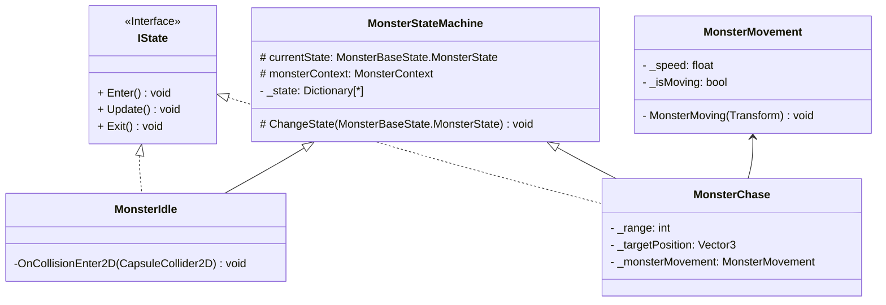

# Unity2D DunGeon Game
> 본 프로젝트는 2D 던전게임과 실시간 카드 게임을 합친다는 컨셉을 바탕으로, 플레이어가 덱을 구성하여 실시간 전투를 통해 몰입할 수 있도록 제작되었습니다.

## 프로젝트 개요
- **플랫폼**: Windows (PC)
- **엔진**: Unity 6 (URP)
- **개발 기간**: 2025.05 ~ 진행 중
- **개발 도구**: C#
- **버전 관리**: Git, GitHub
- **데이터 관리**: Unity ScriptableObject, CSV, Excel
- **개발 인원**: 개인 프로젝트

## 구현상세 
#### 1. **카드 시스템 구현**
- **아키텍처 패턴**: 
- **데이터 테이블 파싱**: 데이터 테이블은 게임 내 수치의 반복적인 수정과 방대한 양의 데이터를 다룸에 있어 이점을 가지므로, 기획자가 제작한 데이터 테이블을 CSV 데이터로 변환하여 스크립터블 오브젝트에 넣을 수 있도록 코드를 작성했습니다.(+string 자료형이 불변 객체인 이유, 메모리·성능상의 이점과 GC와의 관계, StringBuilder)
- **스크립터블 오브젝트**
 - 유니티의 스크립터블 오브젝트는 구조가 같은 대량의 서로 다른 오브젝트를 다루는데에 용이한 유니티의 **데이터 컨테이너**로, 복수의 데이터를 빠르게 에셋으로 만드어 저장하여 사용할 수 있다는 이점이 있습니다. 이에 본 프로젝트에서는 이를 이용하여 프로젝트의 핵심 시스템인 '카드 시스템'에 필요한 카드를 간편하고 빠르게 제작했습니다.
 - MonoBehavior 오브젝트와의 차이점
  - MonoBehavior: MonoBehavior 클래스를 상속받는 스크립트는 기본적으로 유니티의 GameObject와 Transform 클래스를 상속받게 되어 단순 컨테이너를 구현할 때에는 메모리 공간 효율에 있어 단점을 갖습니다.
  - C#:
  - ScriptableObject: ScriptableObject는 유니티 내에서 **에셋**으로 저장되어 오브젝트 생성 없이도 작동하여 여러 씬에서 데이터에 접근할 수 있다는 이점을 가집니다.
--ㄹㅁㄴㅇㄹㅁㄴ
- **카드 덱 순환 시스템**: 카드 덱은 사용 전, 후 카드 리스트와 각 키에 할당되는 사용 중 배열로 구성하여, 이를 유니티의 랜덤 매서드를 사용하여 구현하였습니다.(딕셔너리, 리스트, 해쉬테이블의 특징과 차이점-->메모리 공간과 시간 복잡도를 중심으로)
#### 2. 오브젝트 풀링을 통한 최적화
- **힙 메모리 효율성**: Instantiate는 호출과정에서 힙에 메모리를 할당하는데, 이때 오브젝트 풀링을 통해 필요한 메모리를 미리 할당함으로서 낭비되는 메모리 공간을 줄일 수 있도록 구현했습니다.
- **Garbage Collection 대상을 줄임**: Garbage Collection은 더이상 사용하지 않는 객체를 자동으로 수거하여 메모리 공간에서 삭제하는 시스템으로, 객체를 삭제하는 동안 게임은 멈추기 때문에 오브젝트 풀링을 통해서 가비지 컬렉터의 실행을 줄임으로서 런타임 중지를 방지했습니다.(+GC 스파이크, Cpp와의 메모리 관리 방식 차이)
#### 3. 캐릭터
- **유니티 이벤트 시스템**: 스킬 사용 키 입력 시 발생하는 동작들을 손쉽게 관리하기 위하여 유니티 이벤트를 사용하였습니다.
#### 4. 몬스터 인공지능
 -**FSM**: FSM은 어쩌구 저쩌구-->특성 정리 및 단점을 기반으로 다음 단계(행동트리 등) 설계, 구현
  -구현: `MonsterBaseState`를 베이스로 하여, 몬스터의 상태를 `MonsterIdleState`, `MonsterChaseState`, `MonsterAttackState`, `MonsterBackState`로 나누어 `MonsterStateMachine`을 통해 전이함수를 구현하였습니다.

## 기술적 포인트 & 문제해결
- 문제 원인-->해결방안-->개념학습 순으로 정리할 것(구체적 분석과 해결 방법 제시-->프로파일러를 이용하여 수치기반 분석, 특정 기법 도입 명시(오브젝트 풀링 등))
- 카드 덱 순환 시스템을 구현하는 과정에서 배열 및 딕셔너리 초기화 과정에서 문제가 발생함-->유니티의 객체 수명 주기(생명주기)에 대해 학습-->게임 매니저 클래스 및 인터페이스를 통해 각 객체들의 초기화 문제 해결
 - 유니티 메서드의 실행 순서: `Awake()`-->`OnEnable()`-->`Start()`-->`FixedUpdate()`-->`OnTrigger()`-->`OnCollision()`-->`Update()`-->`LateUpdate()`-->OnDisable()`-->`OnDestroy()`
## 향후 개발 로드맵
- 유니티의 상속과 컴포지션 개념의 학습 및 적용(=둘의 차이점을 알고 이를 적극 반영하는 시스템 설계 및 구현)-->컴포넌트 조합만을 이용한 기능 구현?
- 씬 관리와 재사용 학습(+씬이 갖는 자원 소모 학습)
- 캔버스의 성능 이슈와 최적화 기법 학습
- 몬스터 인공지능의 경로탐색 알고리즘 구현 + 행동트리
- 싱글턴(게임 내 전역 상태를 관리하는 매니저 클래스 설계), 옵저버, 전략 디자인 패턴 사용해 보기
- 유지 보수성과 확장성을 고려한 설계
- OnCollisionEnter와 OnTriggerEnter의 차이
- Raycast활용
- 이벤트와 델리게이트의 차이(이벤트의 리소스 소모)
- 이벤트 버스
- 멀티 플랫폼의 입력 구현(Input System 패키지가 이벤트니까 이벤트로?)
- 게임 시작, 일시정지, 종료의 구현 방식
- PlayerPrefs, 직열화...?
- 자료조사 경험 정리(=모르는 것을 어떻게 공부했는가?)
- API 연동시켜보기
- 벡터 공부 및 적용
- JsonUtility 사용 및 특성 정리(논문 참고)
- 유니티 프로파일러 사용해보기
- 상황–과제–행동–결과(S-T-A-R 기법) 순으로 정리
- 난 프로그래머이기 전에 학자인 것을 명심할 것...

## Contact Me
- eMail: moonshine1004@naver.com
